

 

# Transformada de cossenos   e compressão de sinais

## Hallison Paz

#### 28 de janeiro de 2024

<!-- _paginate: false -->

---

# Consegue ver a diferença?

<table>
  <tr>
    <td style="border: none;">  
(A)
 </td>
    <td style="border: none;">
(B)
</td>
    
</td>
   </tr> 
</table>

---

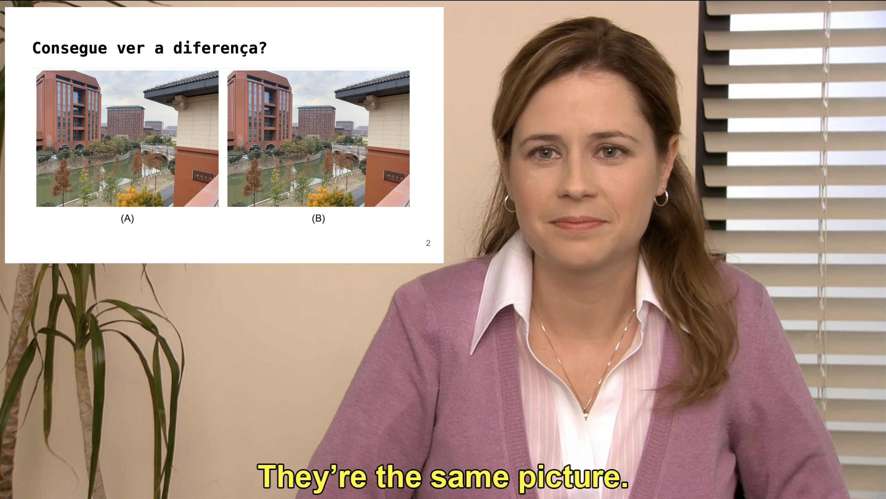

---

# Consegue ver a diferença?

<table>
  <tr>
    <td style="border: none;">  
<b>(A) 1.6 MB</b>
 </td>
    <td style="border: none;">
<b>(B) 157 KB</b>
</td>
    
</td>
   </tr> 
</table>

---

# Objetivos

- Entender os fundamentos de compressão
- Compreender as propriedades da Transformada de Cossenos
- Aplicar a Transformada Discreta de Cossenos (DCT) na compressão de sinais

---

# Compressão

<!-- 
<table>
  <tr style="border: none;">
    <td style="border: none; bgcolor: #000000">  </td>
    <td style="border: none;"></td>
    
</td>
   </tr> 
</table> -->

----

# Exemplo do JPEG

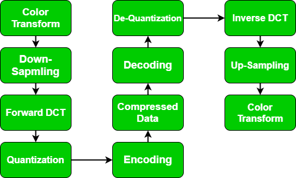

---

# Por que Transformada de Cossenos?

- Representação do sinal em termos de frequências
- Compactação de energia
- Computacionalmente eficiente

----

# Fundamentos

<!-- _backgroundColor: #ff8aef -->

<!-- _paginate: false -->

---

# Representação de sinal discreto

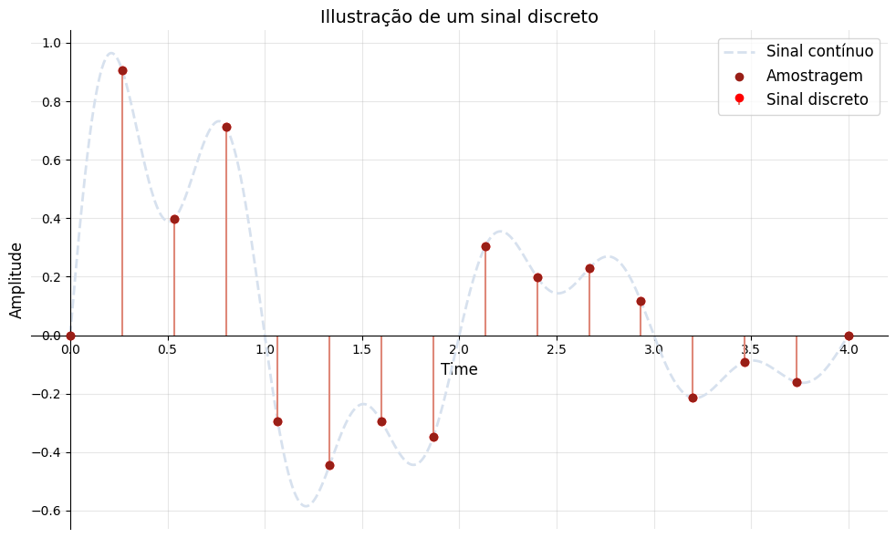

---

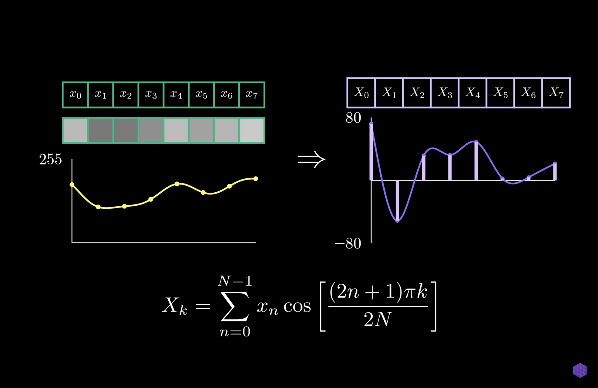
<!-- _backgroundColor: #000000 -->

<!-- _footer: from The Unreasonable Effectiveness of JPEG: A Signal Processing Approach -->

---

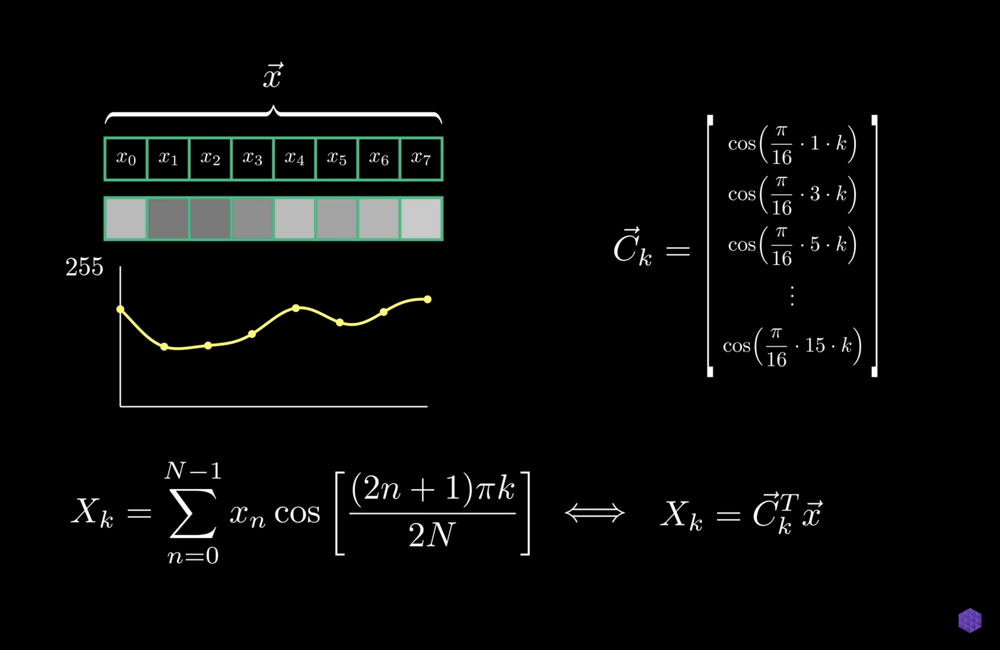

<!-- _backgroundColor: #000000 -->
<!-- _footer: from The Unreasonable Effectiveness of JPEG: A Signal Processing Approach -->

---

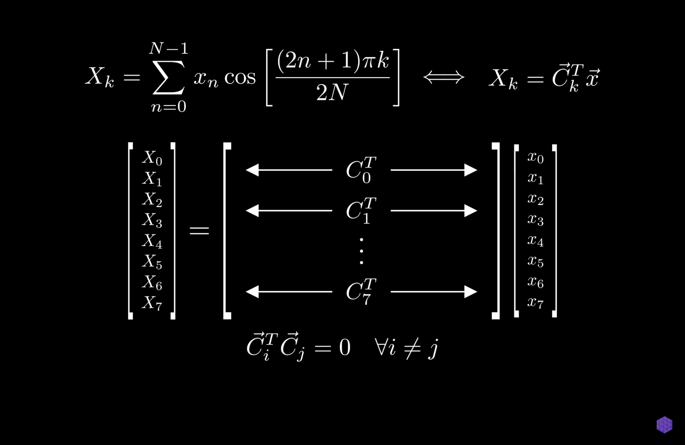

<!-- _backgroundColor: #000000 -->
<!-- _footer: from The Unreasonable Effectiveness of JPEG: A Signal Processing Approach -->

---

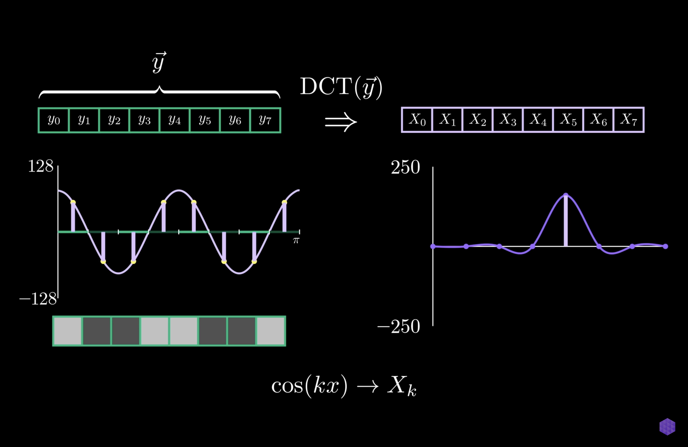

<!-- _backgroundColor: #000000 -->
<!-- _footer: from The Unreasonable Effectiveness of JPEG: A Signal Processing Approach -->

---

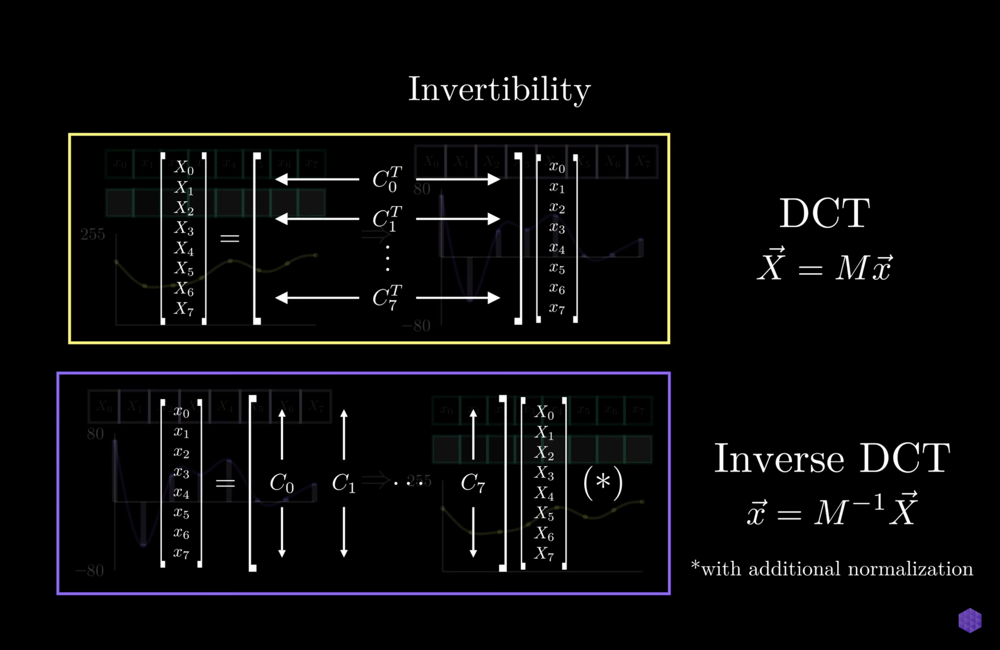

<!-- _backgroundColor: #000000 -->
<!-- _footer: from The Unreasonable Effectiveness of JPEG: A Signal Processing Approach -->

---

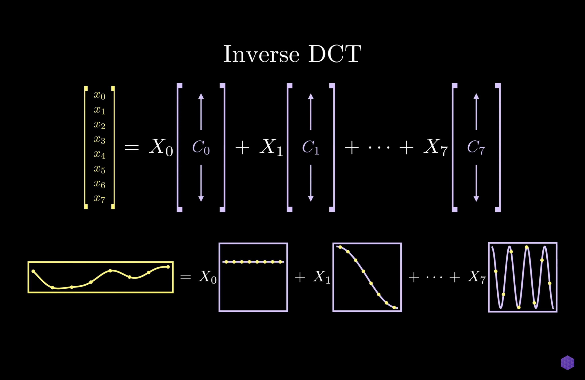

<!-- _backgroundColor: #000000 -->
<!-- _footer: from The Unreasonable Effectiveness of JPEG: A Signal Processing Approach -->

---

# Transformada Discreta de Cossenos

$$
F(k) = \alpha(k) \sum_{n=0}^{N-1} f(n) \cos\left[\frac{\pi (2n + 1) k}{2N}\right]
$$

Em que:
- $k = 0, 1, \dots, N-1$
- $\alpha(k)$ is the normalization factor:
  $$
  \alpha(k) =
  \begin{cases}
    \sqrt{\frac{1}{N}}, & \text{if } k = 0, \\
    \sqrt{\frac{2}{N}}, & \text{if } k > 0.
  \end{cases}
  $$

---

# Transformada Discreta Inversa de Cossenos

 

$$
f(n) = \sum_{k=0}^{N-1} \alpha(k) F(k) \cos\left[\frac{\pi (2n + 1) k}{2N}\right]
$$

Em que:
- $n = 0, 1, \dots, N-1$

---

# Aplicação - Compressão de Imagens

<!-- _backgroundColor: #ffc556 -->
<!-- _paginate: false -->

---

# Operações na Compressão JPEG

 

---

# DCT em 2D

$$
F(u, v) = \alpha(u) \alpha(v) \sum_{x=0}^{N-1} \sum_{y=0}^{M-1} f(x, y) \cos\left[\frac{\pi (2x + 1) u}{2N}\right] \cos\left[\frac{\pi (2y + 1) v}{2M}\right]
$$

Em que:
- $u = 0, 1, \dots, N-1$
- $v = 0, 1, \dots, M-1$
- $\alpha(u)$ e $\alpha(v)$ são fatores de normalização:
  $$
  \alpha(k) =
  \begin{cases}
    \sqrt{\frac{1}{N}}, & \text{if } k = 0, \\
    \sqrt{\frac{2}{N}}, & \text{if } k > 0.
  \end{cases}
  $$

---

# DCT inversa em 2D:

 

Para reconstruir o sinal original $f(x, y)$ a partir de $F(u, v)$, usamos:

$$
f(x, y) = \sum_{u=0}^{N-1} \sum_{v=0}^{M-1} \alpha(u) \alpha(v) F(u, v) \cos\left[\frac{\pi (2x + 1) u}{2N}\right] \cos\left[\frac{\pi (2y + 1) v}{2M}\right]
$$

---

# Base $8 \times 8$

- Imagem é segmentada em retalhos $8 \times 8$.
- DCT é aplicada em cada retalho.

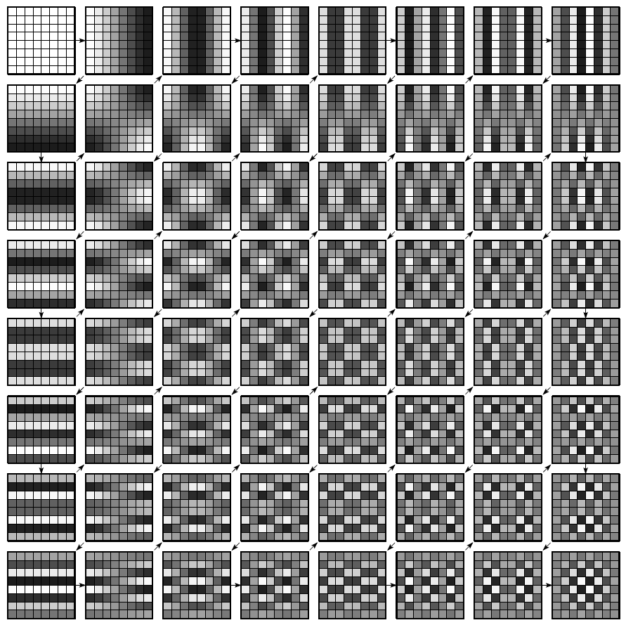

<!-- _footer: Image from https://www.oliviergibaru.org/courses/NA_Compress.html -->
<!-- _paginate: false -->

---

# Concentração de energia nas baixas frequencias

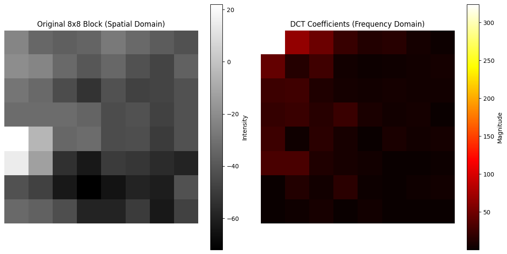

---
# Quantização

- Coeficientes quantizados
- Valores pequenos $\rightarrow$ 0 (zero)

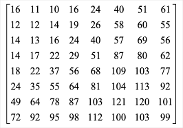

---

## Valores quantizados

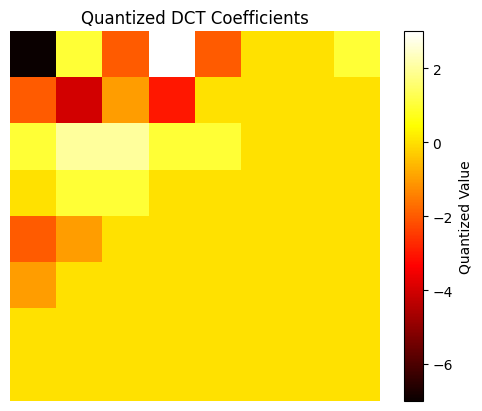

<table>
    <!-- <thead>
    <tr>
        <th></th>
        <th>0</th>
        <th>1</th>
        <th>2</th>
        <th>3</th>
        <th>4</th>
        <th>5</th>
        <th>6</th>
        <th>7</th>
    </tr>
    </thead> -->
    <tbody>
    <tr>
        <!-- <th>0</th> -->
        <td>-7</td>
        <td>1</td>
        <td>-2</td>
        <td>3</td>
        <td>-2</td>
        <td>0</td>
        <td>0</td>
        <td>1</td>
    </tr>
    <tr>
        <!-- <th>1</th> -->
        <td>-2</td>
        <td>-4</td>
        <td>-1</td>
        <td>-3</td>
        <td>0</td>
        <td>0</td>
        <td>0</td>
        <td>0</td>
    </tr>
    <tr>
        <!-- <th>2</th> -->
        <td>1</td>
        <td>2</td>
        <td>2</td>
        <td>1</td>
        <td>1</td>
        <td>0</td>
        <td>0</td>
        <td>0</td>
    </tr>
    <tr>
        <!-- <th>3</th> -->
        <td>0</td>
        <td>1</td>
        <td>1</td>
        <td>0</td>
        <td>0</td>
        <td>0</td>
        <td>0</td>
        <td>0</td>
    </tr>
    <tr>
        <!-- <th>4</th> -->
        <td>-2</td>
        <td>-1</td>
        <td>0</td>
        <td>0</td>
        <td>0</td>
        <td>0</td>
        <td>0</td>
        <td>0</td>
    </tr>
    <tr>
        <!-- <th>5</th> -->
        <td>-1</td>
        <td>0</td>
        <td>0</td>
        <td>0</td>
        <td>0</td>
        <td>0</td>
        <td>0</td>
        <td>0</td>
    </tr>
    <tr>
        <!-- <th>6</th> -->
        <td>0</td>
        <td>0</td>
        <td>0</td>
        <td>0</td>
        <td>0</td>
        <td>0</td>
        <td>0</td>
        <td>0</td>
    </tr>
    <tr>
        <!-- <th>7</th> -->
        <td>0</td>
        <td>0</td>
        <td>0</td>
        <td>0</td>
        <td>0</td>
        <td>0</td>
        <td>0</td>
        <td>0</td>
    </tr>
    </tbody>
</table>

---

# Imagem reconstruída

<table>
  <tr>
    <td style="border: none;">  
(A)
 </td>
    <td style="border: none;">
(B)
</td>
    
</td>
    <td style="border: none;"> 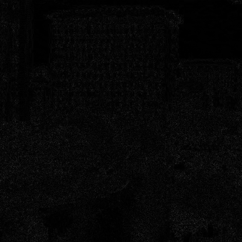 
(C)
 </td>
    <td style="border: none;">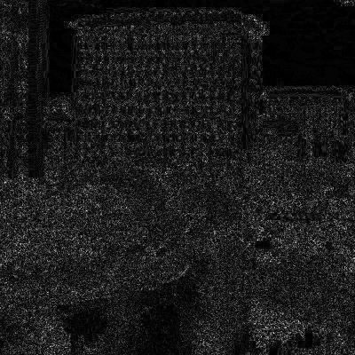
(D)
</td>
    
</td>
   </tr> 
</table>

(A): original; 
(B): reconstruída;
(C): magnitude da diferença;
(D): magnitude da diferença normalizada.

---

# Conclusão

- Transformada de cosseno é uma forma de representar o sinal em termos de frequencias.
- Métodos de compressão exploram percepção.
  - Sistema visual humano é menos sensível aos detalhes de alta frequencia.
- DCT concentra energia do sinal em coeficientes de baixa frequencia, facilitando o descarte de informação.

---

# Para pensar...

### Dá pra fazer melhor?

<!-- _backgroundColor: #ebf47a -->

---

# Referências

- 📖 LIM, J. S. Two-Dimensional Signal and Image Processing. Prentice Hall, 1990. Páginas 165 a 179.
- ▶️ Reducible. The Unreasonable Effectiveness of JPEG: A Signal Processing Approach. Disponível em: https://youtu.be/0me3guauqOU?si=xGvW6sP1Kw9DzPLK
- 🔗 Olivier Gibaru. Image Compression. Disponível em: https://www.oliviergibaru.org/courses/NA_Compress.html

<!-- _paginate: false -->

